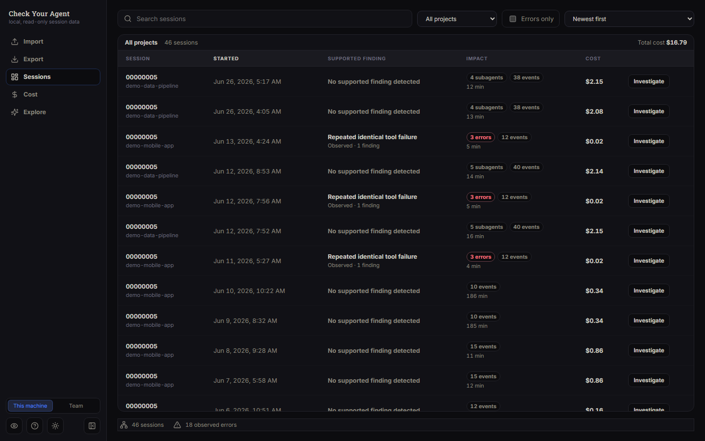
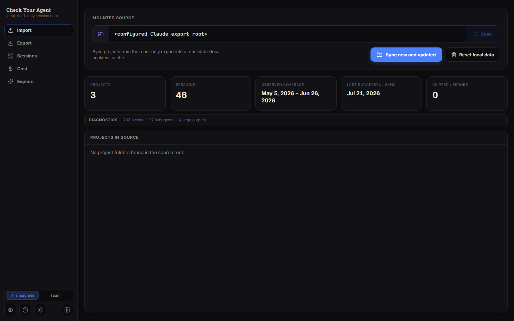
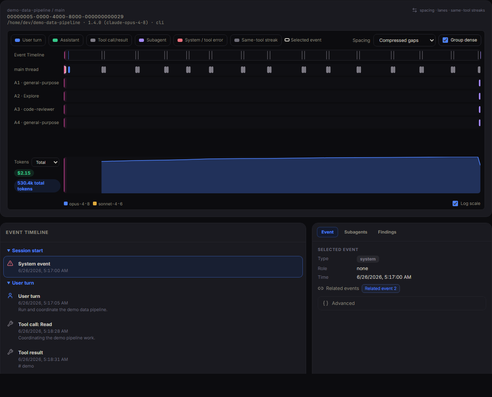
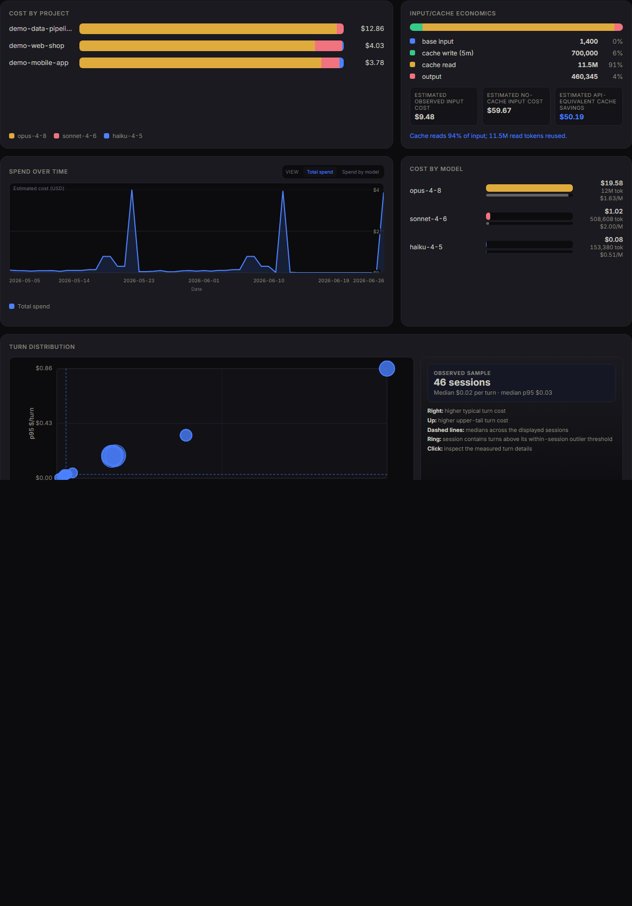
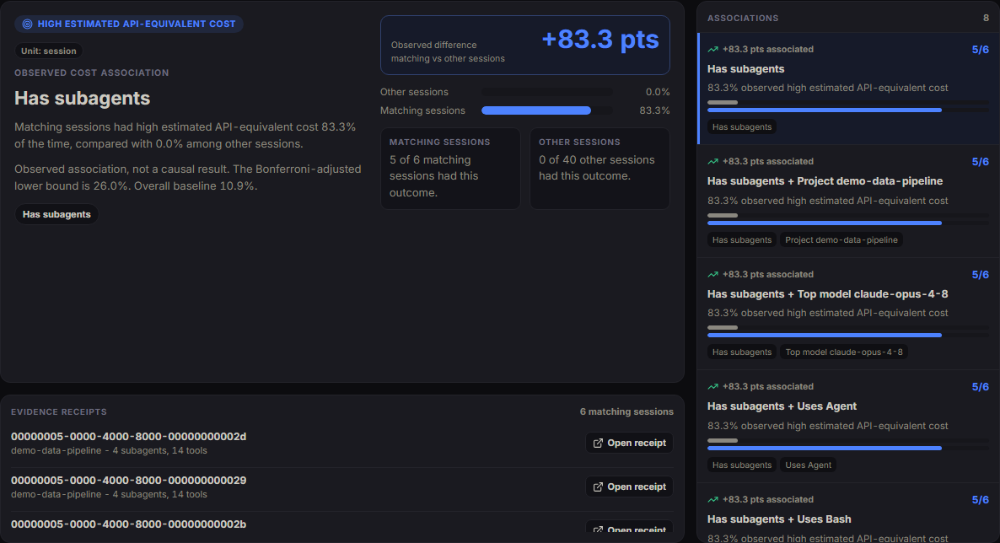
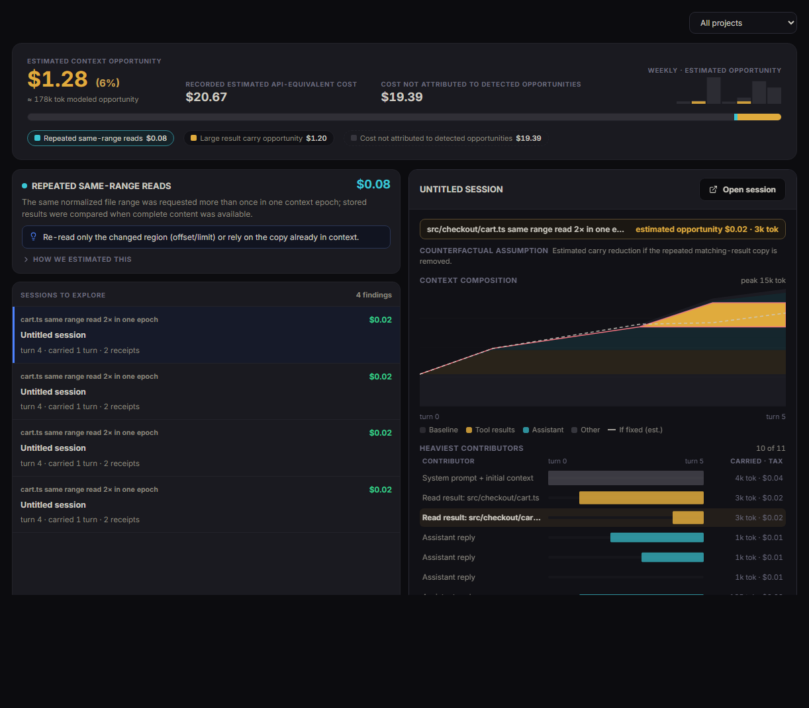
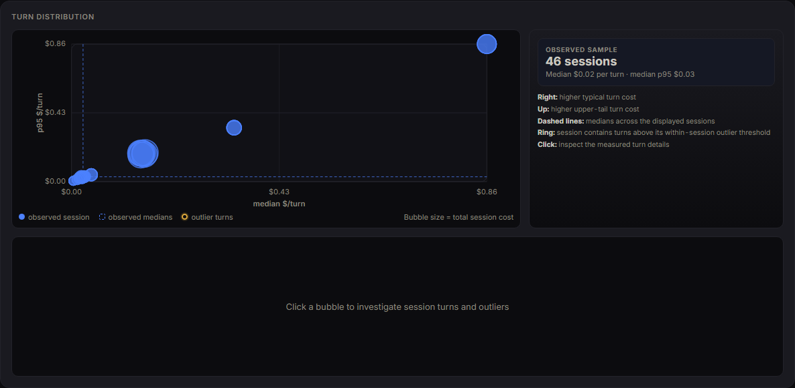

# Check Your Agent

Local, evidence-backed forensics for Claude Code spend.
[checkyouragent.dev](https://checkyouragent.dev)

Claude Code writes a detailed record of every session to `~/.claude/projects`.
Check Your Agent turns that record into an estimated API-equivalent cost,
observed activity, and supported findings with evidence receipts. It runs
entirely locally — no accounts, no telemetry, no uploads — and never modifies
the original logs. Tools like ccusage tell you *what* you used; Check Your Agent
helps you investigate *why* a session was expensive or unusual.

> [!NOTE]
> This is early-stage software. The UI distinguishes values that are observed,
> estimated, inferred, or associated. API-equivalent costs are estimates from
> recorded tokens and bundled pricing tables, not invoice amounts. Findings and
> experimental associations are leads to investigate, not causal conclusions.

## What It Does Today

- **Import** synchronizes Claude Code project folders from a configured,
  read-only export root into a rebuildable SQLite index of sessions, events,
  messages, tool calls/results, subagents, persisted outputs, and supported
  findings. Re-importing a changed project rebuilds that project from source.
- **Sessions** — an investigation board with supported findings, observed
  errors, subagent fanout, event volume, duration, estimated API-equivalent
  cost, search, filters, and sorting.
- **Session workspace** — summary tiles, event timeline and trace lanes, tool
  activity, a selectable subagent heatmap, in-session search, findings with
  evidence receipts, and a raw event inspector.
- **Cost** — estimated API-equivalent cost by project, model, and token
  category; an interactive cost-over-time chart; spike detection; turn
  distribution; and session outliers. Optional date-aware historical pricing.
- **Explore** — limit-hit analysis, estimated context opportunity, and Usage
  Drivers, plus an **Experimental** section for the observed-activity Usage
  Mindmap and non-causal subgroup associations.
- **Team bundles** — export allowlisted aggregates designed to omit raw
  conversation content at structural or team privacy levels, then import them
  for team Overview and Cost views. New exports use schema v3; v1 and v2 bundles
  remain importable after sanitization.
- **Privacy mode** reduces visible sensitive text. Review every screenshot before
  sharing it; display blur is not data sanitization.

Experimental views deliberately make narrower claims. Usage Mindmap counts
observed tool calls and text-only assistant steps, then classifies that activity
with explicit rules; it is not cost attribution. Subgroups reports associations
in a declared session or tool-call sample, includes effect size, uncertainty,
multiple-comparison correction, and receipts, and does not claim causation.

Everything runs locally. No accounts, no telemetry, no external calls; the raw
export is mounted read-only and never modified.

<!-- ship-kit:P03-demo-start -->
### Try it with demo data

No Claude Code exports handy? On the **Import** screen, when the source has no
projects and the cache is empty, click **Load demo data**. This imports a
bundled, fully synthetic dataset (`demo/claude-export/`, generated by
`demo/generate_demo_data.py`) that exercises every screen — session
investigation, cost analytics, context economics, subgroup discovery, and the
usage map. The demo
projects are named `demo-*`; **Reset local data** removes them like any other
import.
<!-- ship-kit:P03-demo-end -->

## Screenshots

[](docs/media/demo.webm)

*Loading the built-in demo data, scanning Sessions, and opening Context Economics. [Full-resolution recording](docs/media/demo.webm).*

These screenshots are static repository assets. They are examples of implemented
screens, not live demos.

| Import | Sessions | Session workspace |
| --- | --- | --- |
|  |  |  |

| Cost analytics | Subgroup discovery | Context economics |
| --- | --- | --- |
|  |  |  |

| Cost outlier drilldown |
| --- |
|  |

## How it compares

Check Your Agent is not the only way to look at Claude Code usage. Here is an
honest map and when to reach for each.

| Tool | Best for | Trade-off vs Check Your Agent |
| --- | --- | --- |
| [ccusage](https://github.com/ccusage/ccusage) | Fast daily, monthly, and session usage/cost reports across coding-agent CLIs (`npx ccusage`) | Descriptive accounting rather than local evidence-backed session investigation |
| [token-dashboard](https://github.com/nateherkai/token-dashboard) | A local dashboard over the same logs, with rule-based suggestions | Shallower attribution: heuristic rules rather than calibrated context-carry accounting |
| [Sniffly](https://github.com/chiphuyen/sniffly) | Error-pattern stats across sessions | Focused on errors rather than estimated cost and evidence-backed investigation |
| [Anthropic native analytics](https://code.claude.com/docs/en/analytics) | Organization usage, spend, adoption, and team insights for Team/Enterprise and Claude Console API customers | Aggregate service-side reporting rather than local raw-session investigation |
| **Check Your Agent** | Deep local forensics: which sessions merit investigation, with observed activity, estimated cost, and receipts | Heavier setup than a one-line CLI; Claude Code only (single agent) |

Short version: reach for `ccusage` when you want a number in ten seconds; reach
for Check Your Agent when you want to know *why* the number is what it is and
what to change.

## What It Does Not Do Yet

- It does not ingest Codex, OpenAI, or other agent histories. Current ingestion
  is Claude Code `.claude/projects` JSONL only.
- It is not a live Claude Code integration. It reads files from the configured
  import root when you run an import.
- It does not preserve a durable archive of sessions that disappear from the
  source export. Re-importing a changed project rebuilds that project in the
  SQLite cache from the current files on disk.
- **Reset local data** rebuilds local import tables while preserving settings and
  imported Team data. Remove imported members separately from Team Import; the
  Team reset API can clear all imported bundles. Neither operation deletes
  exported team bundle JSON files from disk.
- Team aggregate views do not include per-session drilldowns because team
  bundles are designed to omit raw session detail.
- The backend is unauthenticated and intended for loopback-only use.

## Input Data

The app expects a directory shaped like Claude Code's project export root:

```text
Data/
  <encoded-project-folder>/
    <session-id>.jsonl
    <session-id>/
      subagents/
        agent-<id>.jsonl
        agent-<id>.meta.json
      tool-results/
        *.txt
    memory/
      *.md
```

Claude Code usually stores this under `~/.claude/projects`. You can copy or
mount that directory as the app's import root. The importer reads session and
subagent JSONL, subagent metadata, and `tool-results/*.txt`. A `memory/`
directory may be present in the source but is intentionally not indexed.
Malformed JSONL or metadata is recorded as an import error while the remaining
source data continues to import where possible.

## Output Data

Source-checkout runs write rebuildable state under the repository data directory:

```text
.ccfr-data/
  ccfr.sqlite3
  settings.json
  team-bundles/
```

Installed `uvx`/`pipx` runs default to the same layout under
`~/.checkyouragent/`. `CCFR_DATA_DIR` overrides either location.

Docker uses a named volume for `/app/data` and mounts `./TeamBundles` at
`/team-bundles`. Team bundle export writes JSON files under
`CCFR_TEAM_BUNDLE_ROOT/exports`. Exports use bundle schema v3 and omit retired
risk-category, loop/max-repeat, and event-sequence inventory. Imports continue
to accept v1 and v2 bundles, sanitize their closed legacy fields, and store the
canonical supported aggregates.

<!-- ship-kit:P07-uvx-run BEGIN — added by P07; P04/P06 must preserve this block verbatim -->
## Run With One Command

With `uv` (or `pipx`) installed, run the app without cloning or building anything:

```bash
uvx checkyouragent          # or: pipx run checkyouragent
```

This serves the app on `http://127.0.0.1:8000`, opens your browser, and uses
`~/.claude/projects` as the import root when it exists, otherwise `./Data`.
Useful flags:

```bash
checkyouragent serve --import-root /path/to/exports
checkyouragent serve --port 8123 --no-browser
checkyouragent serve --demo        # explore with the bundled synthetic dataset
```

The shorter `cya` alias is installed alongside `checkyouragent` and behaves
identically — e.g. `cya serve --demo`.

Building from source? Compile and bundle the UI first with
`python scripts/build_webui.py`; without it the command still serves the API
(and prints how to build the UI).
<!-- ship-kit:P07-uvx-run END -->

## Run With Docker

Prerequisite: Docker with Compose.

Clone the repo, put or mount Claude Code project folders under `Data/`, then run:

```bash
git clone https://github.com/TarekAwwad/checkyouragent
cd checkyouragent
docker compose up --build
```

On Windows PowerShell the same commands work unchanged:

```powershell
git clone https://github.com/TarekAwwad/checkyouragent
cd checkyouragent
docker compose up --build
```

Open:

```text
Frontend: http://localhost:5173
Backend API docs: http://localhost:8000/docs
```

`docker-compose.yml` binds both services to host loopback. It mounts:

- `./Data` as `/imports` read-only.
- `./TeamBundles` as `/team-bundles`.
- `pricing.csv` and `pricing/` read-only for cost estimation.
- A named `ccfr-data` volume for the backend SQLite cache and settings.

Use `docker compose down --remove-orphans` when you need to stop and remove old
containers. Do not use `docker compose down -v` unless you are comfortable
deleting the named backend data volume.

## Run Locally

Prerequisites:

- Python 3.11 or newer.
- `uv`.
- Node.js 20 or newer.

Backend:

```bash
cd backend
uv run --extra dev pytest
uv run uvicorn ccfr.main:app --reload --host 127.0.0.1 --port 8000
```

On Windows PowerShell:

```powershell
cd backend
uv run --extra dev pytest
uv run uvicorn ccfr.main:app --reload --host 127.0.0.1 --port 8000
```

Frontend:

```bash
cd frontend
npm ci
npm run dev
```

On Windows PowerShell:

```powershell
cd frontend
npm ci
npm run dev
```

Open the Vite dev server:

```text
http://localhost:5174
```

The local dev server proxies `/api` to `http://localhost:8000`, so
`VITE_API_BASE` should usually be unset during local development. Set
`VITE_API_BASE` only for a built frontend or a backend that is not reachable
through the dev proxy.

Default backend paths resolve from the repository root:

```text
CCFR_IMPORT_ROOT=<repo>/Data
CCFR_DB_PATH=<repo>/.ccfr-data/ccfr.sqlite3
CCFR_TEAM_BUNDLE_ROOT=<repo>/.ccfr-data/team-bundles
CCFR_PRICING_PATH=<repo>/pricing.csv
CCFR_PRICING_DIR=<repo>/pricing
```

If you want to import from somewhere else, set `CCFR_IMPORT_ROOT` before
starting the backend. The UI path field can select the configured import root or
a descendant; backend requests outside `CCFR_IMPORT_ROOT` are rejected.

## Main Workflow

1. Copy or mount Claude Code project folders into `Data/`, or set
   `CCFR_IMPORT_ROOT` to the export root.
2. Start the backend and frontend.
3. Open **Import** and choose **Sync new and updated** or synchronize a single
   project.
4. Use **Sessions** to sort and filter sessions worth inspecting.
5. Open a session to inspect the timeline, trace, subagents, findings, search
   results, and raw event details.
6. Use **Cost** for estimated API-equivalent cost and token analysis.
7. Use **Explore** for limit hits, context economics, and Usage Drivers. Treat
   Usage Mindmap and Subgroups in the Experimental section as exploratory
   analysis.
8. For team aggregate views, export a team bundle from local scope, switch to
   team scope, import one or more bundle JSON files, then open team Overview or
   Cost.

## Pricing Data

`pricing.csv` is the baseline price table in US dollars per million tokens. The
UI multiplies recorded token counts by this table to estimate API-equivalent
value. These values are not Anthropic invoice amounts and do not model plan
credits, subscription billing, discounts, or account-level adjustments.

The optional `pricing/` directory can contain full snapshots named
`pricing-YYYY-MM-DD.csv`. A historical-pricing request overlays every snapshot
whose date is on or before a session's date; later snapshots win for the same
model. If some observed models have no price row, views label the estimate as
partial and exclude unsupported models from dollar totals. If no observed model
can be priced, dollar associations and totals are unavailable rather than
silently treated as zero. Synthetic fixture events use the explicit zero-cost
`<synthetic>` model.

## License

<!-- ship-kit:P02-license-start -->
Check Your Agent is source-available under the
[Business Source License 1.1](LICENSE). In short: it is free to use for personal
and internal purposes, including internal use inside a company. Offering it to
third parties as a hosted, managed, or embedded service requires a separate
commercial license. On the Change Date (2030-06-04) the code converts to
Apache-2.0. See [`LICENSE`](LICENSE) for the exact terms — the license text
governs.
<!-- ship-kit:P02-license-end -->

## Project Docs

- [Architecture](docs/architecture.md)
- [Documentation audit](docs/documentation-audit.md)
- [Privacy and Data Handling](PRIVACY.md)
- [Security](SECURITY.md)
- [Contributing](CONTRIBUTING.md)
- [Code of Conduct](CODE_OF_CONDUCT.md)
